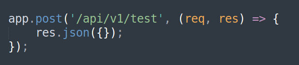
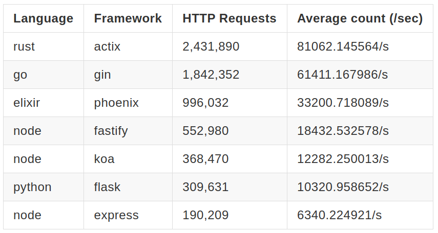

# Benchmark Testing for Popular WebServer Frameworks

## Benchmark Result

## Logs

### 2024.05.04

| Language | Framework | HTTP Requests | Average count (/sec) |
|-----------|-----------|---------------|--------------------------|
| rust | axum | 2,416,726 | 80556.447706/s |
| rust | warp | 2,372,809 | 79092.855368/s |
| rust | actix | 2,323,828 | 77460.388366/s |
| go | gin | 1,786,528 | 59550.105666/s |
| node | elysia | 1,480,998 | 49366.221886/s |
| elixir | phoenix | 1,292,248 | 43074.383487/s |
| node | hono | 917,717 | 30590.355997/s |
| node | fastify | 554,994 | 18499.581757/s |
| node | koa | 372,210 | 12406.836062/s |
| python | flask | 290,908 | 9696.859849/s |
| node | express | 205,323 | 6844.039971/s |
